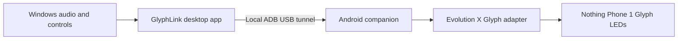

<div align="center">

# GlyphLink

**Turn your Nothing Phone (1) Glyph Interface into a live Windows lighting system.**

Control every Glyph zone manually, build timed light patterns, or make the phone react to music playing on your PC — all through a local USB connection.


[Download](../../releases/latest) · [Installation](#installation) · [Features](#features) · [Build from Source](#build-from-source)

</div>

<!--
SCREENSHOT SETUP
1. Add your home-screen screenshot at docs/images/glyphlink-home.png
2. Remove the opening and closing comment lines around the block below.

<p align="center">
  
</p>
-->

---

## Table of Contents

- [Overview](#overview)
- [Features](#features)
- [How It Works](#how-it-works)
- [Requirements](#requirements)
- [Installation](#installation)
- [Using GlyphLink](#using-glyphlink)
  - [Music](#music)
  - [Manual](#manual)
  - [Pattern Editor](#pattern-editor)
  - [Safe Connection Behavior](#safe-connection-behavior)
- [Project Structure](#project-structure)
- [Build from Source](#build-from-source)
- [Release Validation](#release-validation)
- [Troubleshooting](#troubleshooting)
- [FAQ](#faq)
- [Privacy](#privacy)
- [Contributing](#contributing)
- [License and Credits](#license-and-credits)

---

## Overview

GlyphLink connects a Windows PC to the Glyph Interface on a Nothing Phone (1). The Windows app analyzes audio, drives individual light zones, and plays custom patterns. A lightweight Android companion receives those commands over USB and forwards them to the phone's Glyph service.

The connection runs entirely locally through USB debugging and ADB — Glyph control and audio analysis require no cloud service, account, or Wi-Fi connection.

## Features

| Feature | What it does |
|---|---|
| **Music visualizer** | Captures the audio playing on Windows and maps kicks, snares, and hi-hats across the phone's Glyph zones. Choose Balanced or Aggressive drum detection. |
| **Manual control** | Toggle the camera ring, top slash, center C, bottom line, and bottom dot independently, or switch every zone on or off together. |
| **Pattern editor** | Build light sequences on a visual timeline. Select the active Glyphs, set how long they stay on, add a delay after each beat, and rearrange the result. |
| **Pattern playback** | Play a sequence once, loop it continuously, stop it instantly, or record individual Glyph taps as new beats. |
| **Pattern library** | Create, rename, and autosave up to 15 patterns in the user's AppData folder. Existing patterns persist across app updates. |
| **Live device status** | Shows USB state, ADB device, phone battery level, and charging status from the Windows dashboard. |
| **Background operation** | The Android companion starts with the phone and stays ready. The Windows app can start with Windows and remain available from the system tray. |
| **Disconnect protection** | If the PC stops sending frames or the cable disconnects, the Android watchdog clears the Glyphs automatically. |

## How It Works



The desktop app sends five brightness values, one for each Glyph zone. The Android companion listens only on the phone's local loopback interface, and ADB forwards that local connection through the USB cable. A heartbeat confirms that both sides are still responding.

## Requirements

| Component | Requirement |
|---|---|
| Computer | 64-bit Windows 10 or Windows 11 |
| Phone | Nothing Phone (1), device codename `spacewar` |
| Android | Android 12 or newer |
| ROM support | Evolution X |
| Connection | USB data cable with USB debugging enabled and authorized |

> [!IMPORTANT]
> The current Android companion is built for the Evolution X Glyph adapter. Stock Nothing OS and ROMs without `com.nothing.thirdparty` are not supported by this release.

## Installation

The complete installer includes the Windows app, Android companion APK, a bundled Python runtime, and Windows ADB tools. You do not need to install Python, download an APK separately, or choose a build folder.

1. Download `GlyphLinkSetup-1.3.6.exe` from the [latest release](../../releases/latest).
2. Open the installer.
3. On the phone, enable Developer options:
   `Settings → About phone → Software info → Build number`, then tap **Build number** seven times.
4. Open `Settings → System → Developer options` and enable **USB debugging**.
5. Connect the Nothing Phone (1) with a USB data cable, unlock it, and tap **Allow** on the USB debugging prompt.
6. Wait for every phone check to pass, then select **Install GlyphLink**.
7. Keep the phone connected until the Android companion replies and the Windows app opens.

The installer verifies the bundled files before installing anything, and checks the connected device, Android version, Glyph adapter, and USB response again immediately before installation.

## Using GlyphLink

### Music

Open the **Music** tab and choose a detection style:

- **Balanced Drums** — stronger thresholds for cleaner, less frequent effects.
- **Aggressive Drums** — responds more easily and produces a more active light show.

GlyphLink analyzes the PC's current output audio locally. It separates several frequency ranges and uses spectral changes to detect percussion, rather than simply flashing on overall volume.

### Manual

Open the **Manual** tab and select zones directly from the phone preview or the control list. A selected zone stays on until you select it again, press **All Off**, or switch modes.

### Pattern Editor

Open the **Pattern** tab to build a sequence:

1. Select one or more Glyph zones for the beat.
2. Choose the ON duration.
3. Choose how long GlyphLink should WAIT after that beat.
4. Add the beat to the timeline.
5. Repeat, rearrange, or update beats as needed.
6. Select **Play Once** or **Loop**.

**Record Taps** turns each Glyph press into a beat using the current ON and WAIT values. Patterns autosave locally and can also be saved manually.

### Safe Connection Behavior

- Only one control mode runs at a time.
- Static Manual and Pattern frames refresh before the phone watchdog expires.
- The Android companion switches every Glyph off after approximately 900 ms without a valid frame.
- Closing a connection also clears the lights.
- An incompatible Android signing key is reported without uninstalling the existing app or deleting its data.

## Project Structure

```text
GlyphLink/
├── android/                 Android companion written in Kotlin
├── installer/               Guided installer, validation, and NSIS scripts
├── pc/                      Windows desktop application and Glyph assets
├── release/                 Release notes, hashes, and validation report
├── scripts/                 Android and installer build scripts
├── tests/                   Installer, controller, and interface tests
├── BUILDING.md              Full developer build instructions
├── LICENSE                  MIT license for GlyphLink source
└── THIRD_PARTY_NOTICES.md   Notices for bundled dependencies
```

## Build from Source

The source archive contains the editable desktop app, Android companion, installer, assets, and tests. Compiled dependencies and private signing keys are deliberately excluded.

See [BUILDING.md](BUILDING.md) for the complete Windows runtime, Android SDK, Kotlin, signing, and NSIS build process.

Run the automated tests with:

```bash
python -B -m unittest discover -s tests -v
```

## Release Validation

GlyphLink Setup 1.3.6 was checked with:

- 33 automated installer and controller tests covering bundle integrity, USB preparation, device states, disconnects, changed devices, retries, and companion replies.
- Native Tk interface checks for phone gating, progress stages, retry behavior, and minimum window sizing.
- Validation of all 3,343 bundled payload files after extracting the final installer.
- A byte-for-byte comparison between the installer scripts inside the EXE and the published source.

> [!NOTE]
> The current EXE is not Authenticode-signed. Windows may show a SmartScreen warning for an unknown publisher.

## Troubleshooting

<details>
<summary><strong>The installer is waiting for a phone</strong></summary>

Confirm that the cable supports data, the phone is unlocked, and USB debugging is enabled. Disconnect and reconnect the cable, then accept the authorization prompt on the phone.

</details>

<details>
<summary><strong>The phone appears as unauthorized</strong></summary>

Unlock the phone and select **Allow** on the USB debugging prompt. If no prompt appears, revoke USB debugging authorizations in Developer options, reconnect the cable, and authorize the computer again.

</details>

<details>
<summary><strong>The required Glyph service was not found</strong></summary>

This release requires the Evolution X `com.nothing.thirdparty` Glyph adapter. Check that the supported Evolution X build and its Glyph service are installed.

</details>

<details>
<summary><strong>The Android update has an incompatible signature</strong></summary>

The installed companion was signed with a different key. Setup leaves the existing app and its data untouched. Install an update signed with the same key as the existing companion, or manually back up anything important before replacing the app.

</details>

<details>
<summary><strong>The app does not react to music</strong></summary>

Open the Music tab, confirm that music processing is enabled, and make sure Windows has an active default output device. Switching to Manual or Pattern pauses music frames automatically.

</details>

## FAQ

<details>
<summary><strong>Does this work on macOS or Linux?</strong></summary>

Not tested. The desktop app is built and validated for Windows 10 and 11 only.

</details>

<details>
<summary><strong>Will macOS or Linux support ever be added?</strong></summary>

No.

</details>

<details>
<summary><strong>Does this work on any phone other than the Nothing Phone (1)?</strong></summary>

No. GlyphLink targets the Nothing Phone (1) (`spacewar`) exclusively.

</details>

<details>
<summary><strong>Will support for Phone (2), Phone (2a) or other Nothing devices be added?</strong></summary>

No. I do not own those devices, so there is no way for me to test whether anything works on them. Untested Glyph support is worse than no Glyph support.

</details>

<details>
<summary><strong>How do I know the installer is safe?</strong></summary>

GlyphLink is open source. Every script that runs during installation is published in this repository, and the installer scripts inside the EXE are byte-for-byte identical to the ones here. Read them before you run anything — that is the point of shipping the source.

</details>

<details>
<summary><strong>Then why does Windows warn me about the file?</strong></summary>

The EXE is not Authenticode-signed, so SmartScreen flags it as coming from an unknown publisher. That warning is about the absence of a paid code-signing certificate, not about the contents of the file.

</details>

<details>
<summary><strong>Does it need Wi-Fi, an account or an internet connection?</strong></summary>

No. Everything runs over a local USB/ADB connection. See [Privacy](#privacy).

</details>

<details>
<summary><strong>Can I leave the phone unplugged and use it wirelessly?</strong></summary>

No. The Glyph frames travel through the USB cable. If the cable disconnects, the Android watchdog clears the Glyphs automatically.

</details>

## Privacy

GlyphLink does not require an account or cloud backend. Audio analysis happens on the Windows PC, and lighting commands travel through a local ADB USB tunnel. Saved patterns remain in `%APPDATA%\GlyphLink`.

## Contributing

Issues and pull requests are welcome. When reporting a bug, include:

- Windows version
- Phone ROM and Android version
- GlyphLink version
- The exact installer or app error
- Reproduction steps

Please do not upload private signing keys, local build folders, or generated payloads to an issue or pull request.

## License and Credits

GlyphLink source is available under the [MIT License](LICENSE). Bundled third-party software keeps its original license — see [THIRD_PARTY_NOTICES.md](THIRD_PARTY_NOTICES.md).

Created by **Adam Ali**.

> This is an independent open-source project and is not affiliated with or endorsed by Nothing Technology Limited, Evolution X, Google, or Microsoft. Nothing, Nothing Phone, and Glyph Interface are trademarks of their respective owners.
